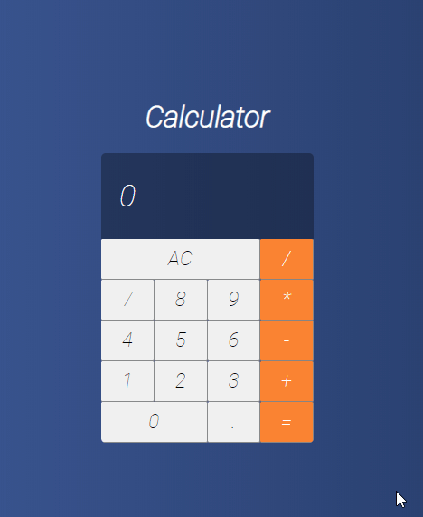

# Calculator

his project was done during a course in [Cod3r](https://www.cod3r.com.br/courses/react-redux-fundamentos-e-2-apps-do-absoluto-zero) the original project was done with React and JavaScript, but I decided to do it with TypeScript

